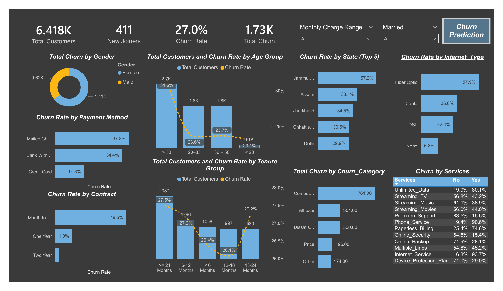
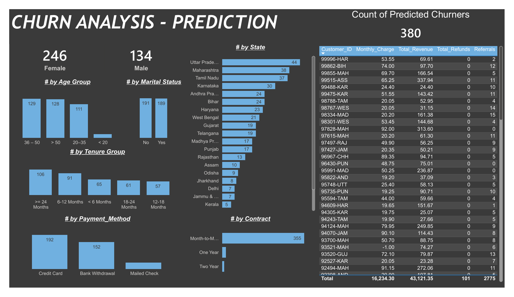
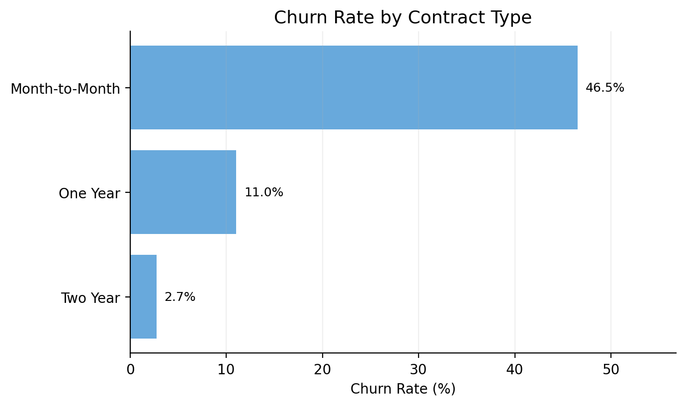
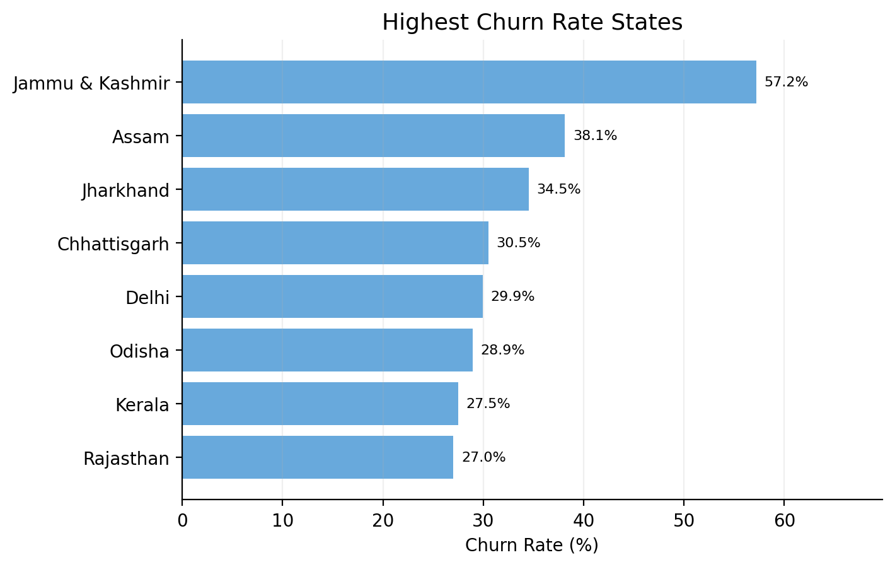
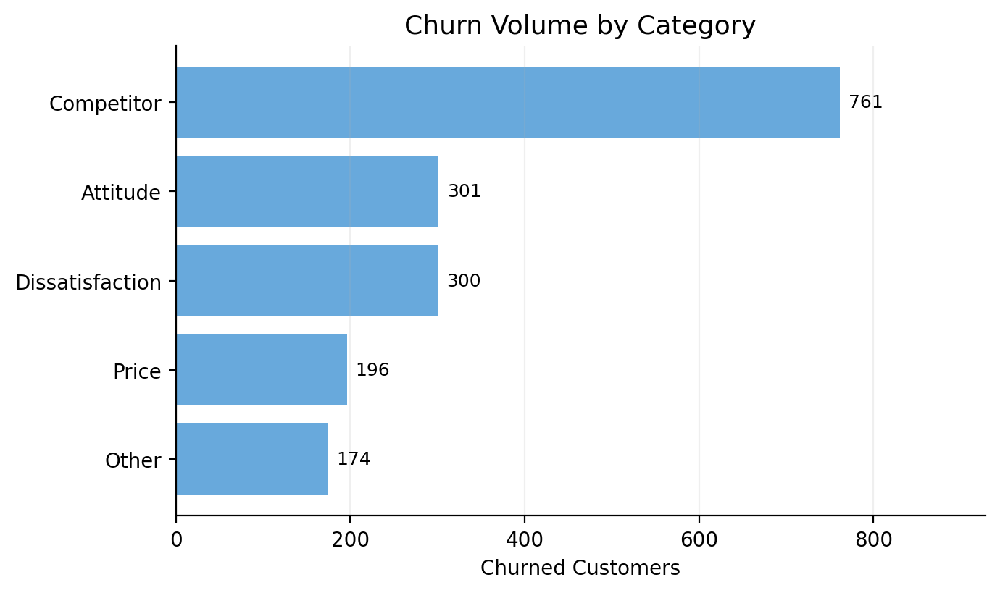
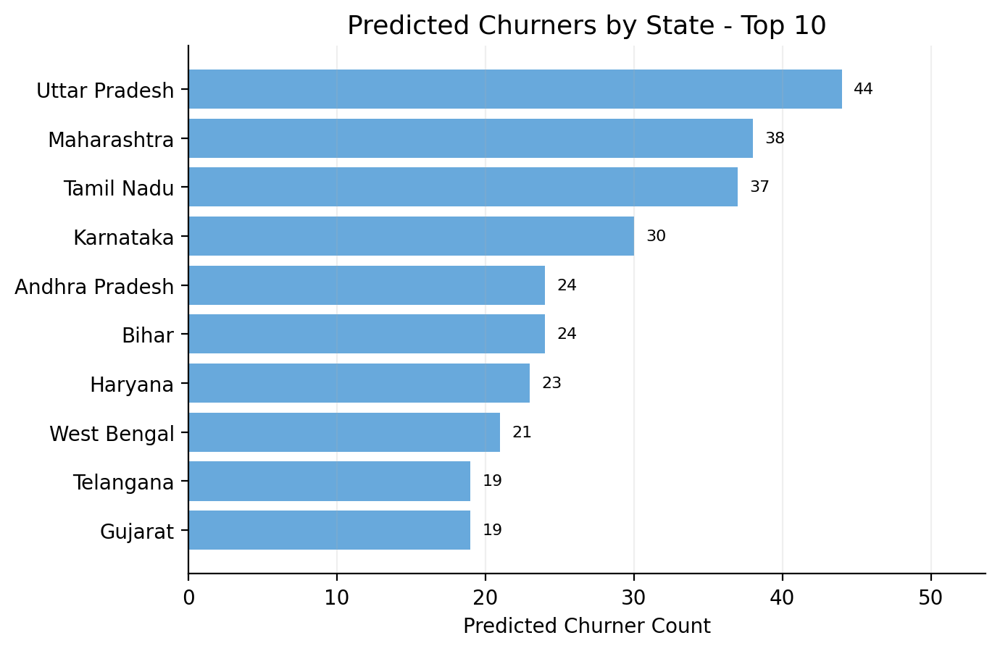
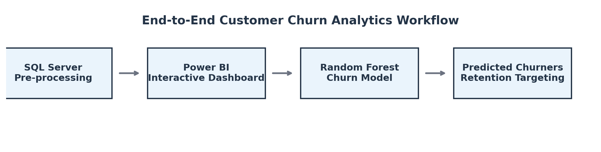
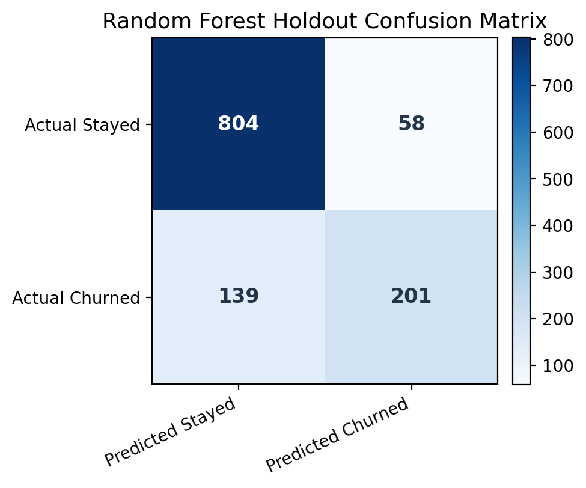
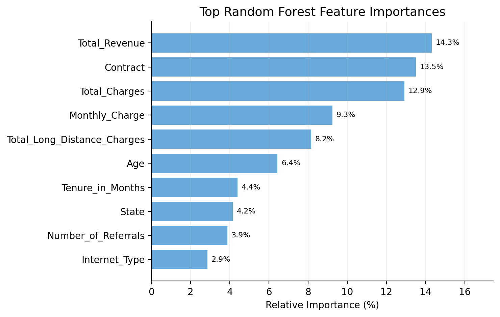

# RetentionIQ: Telecom Churn Intelligence


A full-stack customer churn analytics project that combines **SQL Server preprocessing**, **Power BI business intelligence**, and a **Random Forest classification model** to identify churn drivers and prioritize high-risk customers for retention campaigns.

---

## Executive Summary

Customer churn is a direct threat to recurring revenue. This project analyzes a telecom customer base of **6,418 customers**, identifies segments with elevated churn risk, and predicts future churners among new joiners.

**Portfolio snapshot**

| KPI | Value |
|---|---:|
| Total customers | 6,418 |
| Churned customers | 1,732 |
| Churn rate | 27.0% |
| New joiners | 411 |
| Predicted future churners | 380 |
| Random Forest holdout accuracy | 84% |
| Churn class precision / recall / F1 | 78% / 59% / 67% |

The analysis found that churn is concentrated among **month-to-month contracts**, **mailed check and bank withdrawal payment methods**, **customers aged over 50**, and selected high-risk states. The model output helps the business move from descriptive reporting to proactive retention targeting.

---

## Dashboard Preview

### Churn Analysis Dashboard



### Churn Prediction Dashboard



---

## Business Questions Answered

1. What is the current churn rate and customer distribution across stayed, churned, and joined customers?
2. Which customer segments have the highest churn rate by contract, payment method, age, tenure, state, and internet type?
3. Which churn categories and churn reasons contribute most to total churn volume?
4. Which services are most associated with churned customers?
5. Which states and cohorts should be prioritized for retention campaigns?
6. Which new joiners are predicted to churn and should be targeted first?
7. What is the revenue exposure associated with churned or predicted churn customers?

---

## Key Insights

### 1. Contract type is the strongest business lever

Month-to-month contracts show the highest churn risk at **46.5%**, compared with **11.0%** for one-year contracts and **2.7%** for two-year contracts. This suggests that retention programs should focus on converting high-value month-to-month customers into longer-term plans.



### 2. Geographic churn is uneven

The top churn-rate states include **Jammu & Kashmir, Assam, Jharkhand, Chhattisgarh, and Delhi**. This supports a regional retention strategy instead of one generic campaign.



### 3. Competitor pressure is the largest churn category

The largest churn category is **Competitor**, with 761 churned customers. This points to pricing, device offers, data allowances, and speed as likely competitive battlegrounds.



### 4. The prediction layer enables proactive action

The Random Forest model identified **380 predicted churners** among new customers. Most predicted churners are on **month-to-month contracts**, making them suitable for onboarding, loyalty, and plan-conversion interventions.



---

## End-to-End Project Workflow



| Layer | Work Completed | Recruiter-Relevant Skills |
|---|---|---|
| SQL Server | Data cleaning, feature preparation, business-question queries | CTEs, window functions, aggregations, segmentation, data quality checks |
| Power BI | Churn KPI dashboard and prediction dashboard | KPI cards, slicers, bar charts, matrices, interactive reporting, storytelling |
| Python / ML | Random Forest model to classify churn risk | pandas, scikit-learn, train-test split, model evaluation, feature importance |
| Business Analytics | Insights and recommendations | Customer segmentation, churn drivers, revenue at risk, retention strategy |

---

## Machine Learning Model

**Model used:** Random Forest Classifier  
**Target variable:** `Customer_Status`, encoded as `Stayed = 0`, `Churned = 1`  
**Dropped leakage / non-predictive fields:** `Customer_ID`, `Churn_Category`, `Churn_Reason`  
**Train-test split:** 80/20  
**Number of trees:** 100  
**Random state:** 42

### Holdout Performance

| Class | Precision | Recall | F1-score | Support |
|---|---:|---:|---:|---:|
| Stayed | 0.85 | 0.93 | 0.89 | 862 |
| Churned | 0.78 | 0.59 | 0.67 | 340 |
| Accuracy |  |  | 0.84 | 1,202 |



### Top Model Drivers

The model gives high importance to revenue, charges, contract, age, tenure, and geography-related features.



---

## SQL Skills Demonstrated

The SQL script in this repository is written for **SQL Server** and is designed to show more than basic SELECT statements.

Advanced SQL concepts included:

- Common Table Expressions (CTEs)
- Window functions: `ROW_NUMBER`, `RANK`, `DENSE_RANK`, `NTILE`, cumulative `SUM() OVER()`
- Segment-level churn lift calculations
- Pareto analysis for churn reasons
- Cohort analysis by age and tenure
- Service adoption unpivoting with `CROSS APPLY`
- Revenue-at-risk ranking
- Data quality checks
- Prediction output prioritization

Run the SQL file here:

```text
sql/customer_churn_business_questions.sql
```

---

## How to Reproduce

### 1. Load data into SQL Server

Import `Customer_Data.csv` into a staging table such as:

```sql
[dbo].[Customer_Data]
```

Then execute:

```sql
sql/customer_churn_business_questions.sql
```

This creates a clean feature view and runs business-question queries for churn segmentation, cohort analysis, service-level risk, churn reasons, revenue at risk, and predicted churn prioritization.

### 2. Build or refresh Power BI dashboard

Connect Power BI to SQL Server views or imported CSV tables. Create KPI cards for total customers, churn rate, churned customers, and new joiners. Use slicers for monthly charge range and marital status. Use bar charts and matrix visuals for churn by contract, state, payment method, internet type, age group, tenure group, services, and predicted churners.

### 3. Run the ML notebook

Update the file paths in `Churn_Prediction.ipynb`, train the Random Forest model, evaluate the holdout set, generate predictions for new joiners, and export predicted churners for Power BI.

---

## Business Recommendations

1. **Target month-to-month customers first.** Offer plan upgrades, loyalty benefits, and contract conversion incentives.
2. **Create state-specific retention campaigns.** Focus on the highest churn-rate states instead of running one broad campaign.
3. **Respond to competitor-driven churn.** Review device bundles, download speeds, data plans, and price competitiveness.
4. **Improve onboarding for predicted churners.** The 380 predicted churners should enter a retention workflow within the first few weeks of service.
5. **Track churn recall as a business metric.** For retention use cases, missing a churner can be more expensive than contacting a false positive.

---

## Future Improvements

- Replace label encoding with `OneHotEncoder` or target encoding inside a production `Pipeline`.
- Add cross-validation and hyperparameter tuning.
- Tune the classification threshold to improve churn recall.
- Add probability scores instead of only binary churn labels.
- Use SHAP or permutation importance for more explainable churn drivers.
- Monitor model drift and retrain periodically.
- Add campaign response data to measure retention ROI.

---
